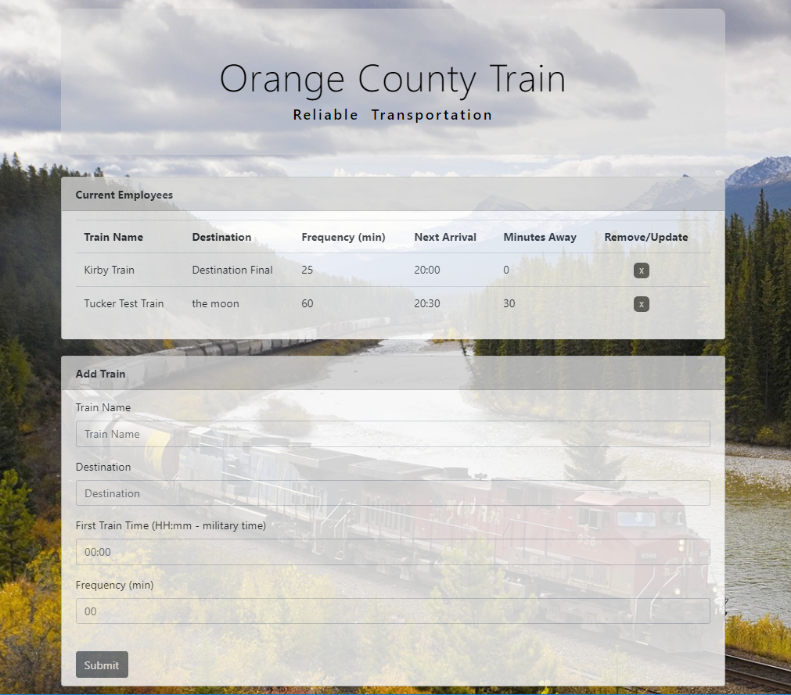

# University of Central Florida
### Coding Bootcamp 
#### Full Stack Developer 

- - -

### Train Scheduler

**Overview Assignment**
On this assignment, I was challenged to implement FIREBASE, to input, retrieve, erase and update data.
I also incorporate the format of Momentjs.com to display the time in a right format. 

**Requirements**
* The app must meet the following specs:
    * When user adds trains, the admin should be able to submit the following:
        * Train Name
        * Destination
        * First Train Time
        * Frequency
    * Relative to the current time calculate the next train arrive.
    * Real Time date to view from different machines. 

    
**Bonus**
* Be able to remove the data from the page and from the firebase.
* Upload the real time information for the different users. 

- - - - 

##### Regarding of the code

*  Libraries and languages used for accomplished this assignment 

    * HTML
    * CSS & Bootstrap
    * Javascript
    * Jquery
    * FIREBASE
    * Momento.js

To learn more about Firebase, click [here!](https://firebase.google.com/)

###[Here you can execute my project](https://marciagzq.github.io/Train-Scheduler/.)

*If any suggestion, do not hesitate to contact me on my personal email: marcia.gzq@gmail.com
I would appreciate any comment, I know it may be very beneficial on my professional growth.*
